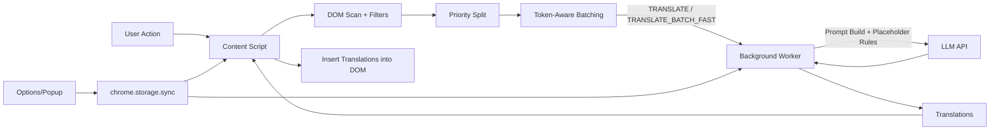
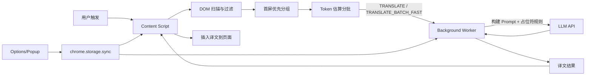

# Blab Translation

<p align="center">
  <a href="#english">🇬🇧 English</a> | <a href="#中文">🇨🇳 中文</a>
</p>

---

<a id="english"></a>

## 🌐 Blab Translation - Chrome Extension

An AI-powered Chrome browser translation extension that supports selection translation and full-page translation, making web translation smarter and more natural.


### ✨ Features

#### Smart Translation
- **Math Formula Preservation**: Automatically detects and preserves MathJax/KaTeX formulas without translation
- **Code Block Protection**: Code snippets remain untouched during translation
- **Elegant Menu Translation**: Sidebar translations align perfectly with original text (not icons)
- **Custom Prompts**: Customize translation style with your own prompts (formal, casual, technical, etc.)

#### Selection Translation
- Shows a translate button when text is selected
- Click the button to translate (popup or inline based on settings)
- Copy translation with one click
- Translations stay visible until explicitly cleared

#### Hover Translation
- Hover a paragraph and press the hotkey (default: Shift) to translate inline
- Translation appears directly below the paragraph as bilingual text
- Press the hotkey again to restore the original view
- Hotkey is configurable in Settings
- Press `Esc` to clear inline translations, or right-click a paragraph/translation to cancel it

#### Full-Page Translation
- Translate the entire webpage with one click
- Translations appear below original text, preserving layout
- Inherits original styling (font, color, size)
- Toggle show/hide translations
- High-performance batch translation (100 items/batch, 8 concurrent)

#### Translation Styles and Display
- Six looks for page translations: Default, Underline, Dashed box, Highlight,
  Quote bar, and Blur until hovered (hover, focus or tap a blurred translation
  to read it). Switching restyles the page at once and translates nothing again
- Bilingual or translation only, switched from any of four places: the Display
  row in the popup, the float ball menu, the Settings page, or `Alt+T`
  (rebind it at `chrome://extensions/shortcuts`)
- In translation-only mode, point at (or tap) a translation to see its
  original in a small card; move away, tap again or press `Esc` to close it

#### Image Text (OCR)
- Right-click any image to read the text in it — screenshots, signs, menus, comics
- Recognition runs on your own device by default: free, offline, no API key
- Translating what it read is a separate step you can switch off — sometimes
  "what does this say" is the whole question
- Or point it at your own vision model when the image is a photograph or
  stylized type the local engine struggles with

#### Video Subtitles
- Bilingual subtitles on YouTube, and on any video whose player carries a
  standard subtitle track — no per-site support needed
- Only translates the subtitles you already have switched on, and hands the
  track back untouched when you switch them off
- Drag to move, drag the edges to resize; position and size are remembered
- Survives fullscreen

#### UI Polish
- Inline translations inherit original typography for a clean, consistent look
- Inline loading indicator is more visible to show translation progress
- Settings controls aligned for consistent spacing and visual hierarchy

#### Float Ball
- Draggable quick action button
- Supports translating selection, page, and toggling translations
- Position auto-saves, persists across page navigation

#### Other Features
- Right-click context menu translation
- Dark/Light theme toggle
- 76 target languages (39 translated free on-device by Chrome's built-in Translator, the rest through your AI service)
- Right-to-left targets (Arabic, Hebrew, Persian, Urdu) are laid out right-to-left, and a right-to-left page translated into a left-to-right language is laid out left-to-right
- Input text translation dialog

### 🚀 Installation

#### 1. Download

```bash
git clone https://github.com/wangqianqianjun/translator.git
cd translator
```

#### 2. Load in Chrome

1. Open Chrome browser
2. Navigate to `chrome://extensions/`
3. Enable "Developer mode" in the top right
4. Click "Load unpacked"
5. Select the `translator` folder

#### 3. Configure API

1. Click the extension icon in the browser toolbar
2. Click "Settings"
3. Fill in API configuration:
   - **Provider**: pick your service; **Custom** shows the **API Endpoint** field
   - **API Endpoint** (Custom only): e.g., `https://api.openai.com/v1/chat/completions`
   - **API Key**: Your API key. Leave it empty for a local model server (see [Local models](#local-models-ollama-lm-studio))
   - **Model Name**: e.g., `gpt-4.1-mini` (pick from the dropdown, or type any model your endpoint serves)
4. Select target translation language
5. Click **Test Connection** to check it. Settings save as you type; there is no save button

### 📖 Usage

#### Selection Translation

1. Select text on any webpage
2. Click the "Translate" button that appears
3. View translation in popup or inline (based on settings), click to copy
4. Press `Esc` or click × to close/clear

#### Hover Translation

1. Move the mouse over a paragraph
2. Press the hover hotkey (default: `Shift`)
3. Translation appears below the paragraph
4. Press the hotkey again to restore the original view
5. Press `Esc` to clear inline translations, or right-click a paragraph/translation to cancel it

#### Full-Page Translation

**Method 1: Float Ball**
1. Click the float ball in the bottom-right corner
2. Select "Translate Page"

**Method 2: Extension Menu**
1. Click the extension icon in toolbar
2. Click "Translate Page"

**Method 3: Context Menu**
1. Right-click on the page
2. Select "Translate this page"

#### Show/Hide Translations

After translation:
1. Click the float ball
2. Select "Hide Translations" or "Show Translations"
3. Translations are preserved, no need to re-translate

#### Document Translation

Runs on our servers against your monthly free page allowance, so it needs a
signed-in account.

1. Open the upload page: the popup's **Translate a Local Document…**, or the
   same item in the toolbar icon's right-click menu.
2. Drop a file on the page or click to pick one. Accepted: PDF (`.pdf`), Word
   (`.docx`), EPUB (`.epub`), MOBI (`.mobi`, `.azw3`), plain text (`.txt`) and
   Markdown (`.md`, `.markdown`).
3. Size limits: PDF 30 MB; Word, EPUB and MOBI 50 MB; TXT and Markdown 10 MB.
   Word, EPUB, TXT and Markdown are measured on your computer first (one page
   = 3,000 characters); anything over 800 pages, an empty file, or a file whose
   contents do not match its extension is refused on the spot, before
   anything is uploaded.
4. The file goes straight to storage through a one-time signed address, and
   the page shows the job's progress. You can close it: the job keeps running,
   the popup lists it, and a notification says when it is done.
5. **If the document turns out longer than estimated**, the job stops and
   asks. The popup's row reads "Needs your confirmation" with a **Review**
   button (the notification is clickable too); the page says how many more
   pages continuing will use. **Continue** carries on; **Cancel Task**, or
   doing nothing until the stated time, cancels it with a full refund.
6. When it is done:
   - **PDF**: **Open Bilingual PDF** / **Open Translated PDF** open the result
     in a tab. **Open** in the popup does the same.
   - **Word, EPUB, TXT, Markdown**: **Save Bilingual File** / **Save
     Translated File** save it as `<name> (bilingual).<ext>` /
     `<name> (translated).<ext>`. **Open** in the popup brings you back to the
     job's page.
   - **MOBI**: the result is read on the website (**View on the web**); there
     is no file to download.

Web PDFs (an open PDF tab, or a link to one) can also be translated from the
popup's **Translate This PDF** and the right-click menu; that path takes PDFs
only.

### ⚙️ Supported APIs

**Works with any OpenAI-compatible API endpoint.** Just configure the endpoint URL, API key, and model name.

| Service | Example API Endpoint | Notes |
|---------|---------------------|-------|
| OpenAI | `https://api.openai.com/v1/chat/completions` | GPT-4o, GPT-4o-mini, etc. |
| **Anthropic Claude** | `https://api.anthropic.com/v1/messages` | Claude Sonnet, Opus, Haiku |
| Azure OpenAI | `https://your-resource.openai.azure.com/...` | |
| Google Gemini | `https://generativelanguage.googleapis.com/v1beta/openai/chat/completions` | Gemini Pro, Flash, etc. |
| DeepSeek | `https://api.deepseek.com/v1/chat/completions` | DeepSeek-V3, etc. |
| OpenRouter | `https://openrouter.ai/api/v1/chat/completions` | Multiple providers |
| Ollama (Local) | `http://localhost:11434/v1/chat/completions` | Local models |
| LM Studio (Local) | `http://localhost:1234/v1/chat/completions` | Local models |

> **Auto-detection**: The extension automatically detects Anthropic Claude API (by domain or `/v1/messages` path) and uses the correct request/response format.

#### Local models (Ollama, LM Studio)

A model server on your own machine or local network needs **no API key**.
Choose **Ollama (Local)** or **LM Studio (Local)** as the Provider, or choose
**Custom** and enter an endpoint on `localhost`, `127.0.0.1`, a private LAN
address (`10.x`, `172.16-31.x`, `192.168.x`) or a `.local` name, and leave
**API Key** empty. No authorization header is sent when the key is empty; if
your server does require one (LM Studio's "Require Authentication"), fill it in
and it is sent as usual.

Both servers have to be told to accept requests from a browser extension:

- **Ollama** only accepts browser extensions listed in `OLLAMA_ORIGINS`, and
  answers anything else with HTTP 403. Set
  `OLLAMA_ORIGINS=chrome-extension://*` in Ollama's environment and restart it
  (on macOS: `launchctl setenv OLLAMA_ORIGINS "chrome-extension://*"`, then quit
  and reopen the Ollama app).
- **LM Studio**: turn on **CORS** in the server settings of the Developer tab,
  or start the server with `lms server start --cors`.

If a request fails, the error names the fix: a 403 from a local server shows
these instructions, and a server that is not running is named by its address.

### 🌍 Supported Languages

**Translation targets:** 76 languages, named in your interface language. 39 of them can be translated free on-device by Chrome's built-in Translator; the other 37 are marked "AI only" in the language menus and go through your AI service.

**Interface:** 简体中文 • 繁体中文 • English • 日本語 • 한국어 • Français • Deutsch • Español • Português • Русский

### 📁 Project Structure

```
translator/
├── manifest.json          # Chrome extension configuration
├── background/            # Background script
├── content/               # Content script & styles
├── popup/                 # Popup menu
├── options/               # Settings page
├── i18n/                  # Internationalization
└── icons/                 # Extension icons
```

### 🧱 Technical Architecture

The extension follows a content-first architecture: content scripts collect and batch text, background scripts handle API calls, and UI surfaces manage user settings.

- **Content Script**: scans DOM, filters code/table/math, batches text with token estimation, inserts translations.
- **Background Worker**: builds prompts, calls OpenAI-compatible or Claude APIs, parses errors.
- **Options/Popup UI**: manages API key, model, prompt, theme, and quick actions.
- **Storage**: settings persisted in `chrome.storage.sync`.

### 🔁 Architecture Flowchart



### 📄 License

MIT License

---

<a id="中文"></a>

## 🌐 叭叭翻译 - 智能翻译插件

一款基于 AI 的 Chrome 浏览器翻译插件，支持划词翻译和全文翻译，让网页翻译更智能、更自然。


### ✨ 功能特性

#### 智能翻译
- **数学公式保留**：自动识别并保留 MathJax/KaTeX 数学公式，不会被翻译破坏
- **代码块保护**：代码片段在翻译过程中保持原样不变
- **优雅的菜单翻译**：侧边栏译文与原文精确对齐（而非与图标对齐）
- **自定义 Prompt**：支持自定义翻译风格（正式、口语化、技术文档等）

#### 划词翻译
- 选中文本后显示翻译按钮
- 点击按钮进行翻译（弹窗或段落内显示，可在设置中切换）
- 支持复制译文
- 译文会保留，需手动清除

#### 悬停翻译
- 鼠标悬停段落并按下快捷键（默认：Shift）触发翻译
- 译文显示在段落下方，呈双语形式
- 再次按快捷键可恢复原文
- 快捷键可在设置中自定义
- 按 `Esc` 清除所有段落译文，或右键段落/译文选择取消

#### 全文翻译
- 一键翻译整个网页
- 译文显示在原文下方，保持原网页布局
- 继承原文样式（字体、颜色、大小）
- 支持显示/隐藏译文切换
- 高性能批量翻译（100条/批，8并发）

#### 译文样式与显示
- 网页译文有六种样式：默认、下划线、虚线框、高亮、引用竖线、模糊（悬停显示；悬停、聚焦或轻点模糊的译文即可看清）。切换立即生效，不会重新翻译
- 双语 / 仅译文可从四处切换：弹窗里的「显示」一行、悬浮球菜单、设置页，或快捷键 `Alt+T`（可在 `chrome://extensions/shortcuts` 改键）
- 仅译文模式下，指向（或轻点）一段译文会弹出小卡片显示原文；移开、再点一次或按 `Esc` 关闭

#### 图片文字（OCR）
- 右键任意图片即可读出其中的文字——截图、路牌、菜单、漫画
- 默认在本机识别：免费、离线、不需要 API Key
- 识别之后是否翻译是可以单独关掉的一步——很多时候你只想知道“这上面写了什么”
- 照片和艺术字本地引擎读不动时，也可以改用你自己的视觉模型

#### 视频字幕
- YouTube，以及任何自带标准字幕轨的播放器，都能显示双语字幕——无需逐站适配
- 只翻译你已经打开的字幕；你把字幕关掉，字幕轨也原样交还
- 可拖动位置、拉边缘改大小，位置与尺寸都会记住
- 全屏下依然显示

#### UI 美化
- 译文继承原始排版，整体视觉更统一
- 内嵌加载提示更清晰，便于感知翻译进度
- 设置页控件对齐，层级更清晰

#### 悬浮球
- 可拖动的快捷操作球
- 支持翻译选中文本、翻译页面、显示/隐藏译文
- 位置自动保存，跨页面保持

#### 其他功能
- 右键菜单快速翻译
- 深色/浅色主题切换
- 支持 76 门目标语言：其中 39 门可用 Chrome 内置翻译免费在本机完成，其余 37 门走 AI
- 阿拉伯语、希伯来语、波斯语、乌尔都语等右到左语言的译文按右到左排版；右到左的页面译成左到右语言时同样按译文自己的方向排版
- 输入文本翻译对话框

### 🚀 安装使用

#### 1. 下载插件

```bash
git clone https://github.com/wangqianqianjun/translator.git
cd translator
```

#### 2. 加载到 Chrome

1. 打开 Chrome 浏览器
2. 地址栏输入 `chrome://extensions/`
3. 开启右上角「开发者模式」
4. 点击「加载已解压的扩展程序」
5. 选择 `translator` 文件夹

#### 3. 配置 API

1. 点击浏览器工具栏中的插件图标
2. 点击「打开设置」
3. 填写 API 配置：
   - **服务商**: 选择你用的服务；选 **Custom** 才会出现 **API 地址** 一栏
   - **API 地址**（仅 Custom）: 如 `https://api.openai.com/v1/chat/completions`
   - **API Key**: 你的 API 密钥。用本地模型服务时留空即可（见[本地模型](#本地模型ollamalm-studio)）
   - **模型名称**: 如 `gpt-4.1-mini`（可从下拉列表选择，也可直接填写你的接口支持的任意模型）
4. 选择目标翻译语言
5. 点「测试连接」检查一下。设置边填边自动保存，没有保存按钮

### 📖 使用方法

#### 划词翻译

1. 在网页中选中需要翻译的文字
2. 点击出现的「翻译」按钮
3. 在弹窗或段落内查看译文（取决于设置），可点击复制
4. 按 `Esc` 或点击 × 关闭/清除

#### 悬停翻译

1. 将鼠标移动到段落上
2. 按下悬停快捷键（默认：`Shift`）
3. 译文显示在段落下方
4. 再次按快捷键恢复原文
5. 按 `Esc` 清除所有段落译文，或右键段落/译文选择取消

#### 全文翻译

**方式一：悬浮球**
1. 点击页面右下角的悬浮球
2. 选择「翻译整个页面」

**方式二：插件菜单**
1. 点击浏览器工具栏的插件图标
2. 点击「翻译当前页面」

**方式三：右键菜单**
1. 在页面空白处右键
2. 选择「翻译整个页面」

#### 显示/隐藏译文

翻译完成后：
1. 点击悬浮球
2. 选择「隐藏译文」或「显示译文」
3. 译文会被保留，再次显示无需重新翻译

#### 文档翻译

跑在我们的服务器上、按月度免费页数计，所以需要先登录账号。

1. 打开上传页：弹窗里的「翻译本地文档…」，或工具栏图标右键菜单里的同名一项。
2. 把文件拖到页面上，或点击选择。支持 PDF（`.pdf`）、Word（`.docx`）、EPUB
   （`.epub`）、MOBI（`.mobi`、`.azw3`）、纯文本（`.txt`）、Markdown（`.md`、
   `.markdown`）。
3. 大小上限：PDF 30 MB；Word、EPUB、MOBI 50 MB；TXT、Markdown 10 MB。Word、EPUB、
   TXT、Markdown 会先在本机数篇幅（3000 字符算一页）；超过 800 页、空文件、内容与扩展名
   对不上的文件当场拒收，什么都不上传。
4. 文件经一次性签名地址直接传到存储，页面显示任务进度。可以关掉页面：任务照常跑，
   弹窗里能看到它，完成时有通知。
5. **文档比预计长时**，任务会停下来问你。弹窗那一行显示「需要你确认」和「查看」按钮
   （通知也可以点）；页面上写明继续要多用几页。点「继续」接着翻；点「取消任务」，
   或到页面写的时间还没处理，任务取消并全额退回。
6. 完成后：
   - **PDF**：「打开双语 PDF」/「打开译文 PDF」在新标签页打开结果；弹窗里的「打开」
     也一样。
   - **Word、EPUB、TXT、Markdown**：「保存双语文件」/「保存译文文件」存成
     `<文件名> (双语).<扩展名>` / `<文件名> (译文).<扩展名>`；弹窗里的「打开」回到这个
     任务的页面。
   - **MOBI**：结果在网站上阅读（「在网页中查看」），没有可下载的文件。

网页上的 PDF（打开着的 PDF 标签页，或指向 PDF 的链接）也可以从弹窗的「翻译此 PDF」
和右键菜单翻译；这条路只接 PDF。

### ⚙️ 支持的 API

**支持所有 OpenAI 兼容的 API 接口**，只需配置接口地址、API Key 和模型名称即可。

| 服务 | API 地址示例 | 说明 |
|------|-------------|------|
| OpenAI | `https://api.openai.com/v1/chat/completions` | GPT-4o, GPT-4o-mini 等 |
| **Anthropic Claude** | `https://api.anthropic.com/v1/messages` | Claude Sonnet, Opus, Haiku |
| Azure OpenAI | `https://your-resource.openai.azure.com/...` | |
| Google Gemini | `https://generativelanguage.googleapis.com/v1beta/openai/chat/completions` | Gemini Pro, Flash 等 |
| DeepSeek | `https://api.deepseek.com/v1/chat/completions` | DeepSeek-V3 等 |
| OpenRouter | `https://openrouter.ai/api/v1/chat/completions` | 多种模型提供商 |
| Ollama (本地) | `http://localhost:11434/v1/chat/completions` | 本地模型 |
| LM Studio (本地) | `http://localhost:1234/v1/chat/completions` | 本地模型 |

> **自动检测**：插件会自动检测 Anthropic Claude API（通过域名或 `/v1/messages` 路径），并使用正确的请求/响应格式。

#### 本地模型（Ollama、LM Studio）

跑在本机或局域网里的模型服务**不需要 API Key**。服务商选 **Ollama (Local)** 或
**LM Studio (Local)**，或者选 **Custom** 并填一个 `localhost`、`127.0.0.1`、
局域网私有地址（`10.x`、`172.16-31.x`、`192.168.x`）或 `.local` 主机名的地址，
**API Key** 留空即可。Key 为空时不发送任何认证头；如果你的服务确实要 Key
（LM Studio 的「Require Authentication」），照常填上就会照常发送。

两种服务都要先允许浏览器扩展访问：

- **Ollama** 只接受 `OLLAMA_ORIGINS` 里列出的浏览器扩展，其余一律回 HTTP 403。
  在 Ollama 的环境里设置 `OLLAMA_ORIGINS=chrome-extension://*` 后重启（macOS：
  `launchctl setenv OLLAMA_ORIGINS "chrome-extension://*"`，再退出并重新打开
  Ollama 应用）。
- **LM Studio**：在 Developer 标签页的服务器设置里打开 **CORS**，或者用
  `lms server start --cors` 启动服务。

请求失败时，错误提示会直接给出做法：本地服务回 403 时显示上面的设置方法，
服务没启动时会写明它的地址。

### 🌍 支持的语言

**目标语言：** 76 门，名字按界面语言显示。其中 39 门可用 Chrome 内置翻译免费在本机完成；其余 37 门在语言菜单里标「仅 AI」，走你配置的 AI 服务。

**界面语言：** 简体中文 • 繁体中文 • English • 日本語 • 한국어 • Français • Deutsch • Español • Português • Русский

### 📁 项目结构

```
translator/
├── manifest.json          # Chrome 扩展配置
├── background/            # 后台脚本
├── content/               # 内容脚本 & 样式
├── popup/                 # 弹出菜单
├── options/               # 设置页面
├── i18n/                  # 国际化
└── icons/                 # 插件图标
```

### 🧱 技术架构说明

插件采用内容脚本驱动的架构：内容脚本负责收集与分批，后台负责调用 API，UI 管理用户配置。

- **Content Script**：扫描 DOM，过滤代码/表格/公式，基于 token 估算分批并插入译文。
- **Background Worker**：构建 Prompt，调用 OpenAI 兼容或 Claude API，统一错误处理。
- **Options/Popup UI**：管理 API Key、模型、Prompt、主题与快捷操作。
- **Storage**：配置持久化在 `chrome.storage.sync`。

### 🔁 技术架构流程图



### 📄 License

MIT License

---

<p align="center"><b>Made with ❤️</b></p>
